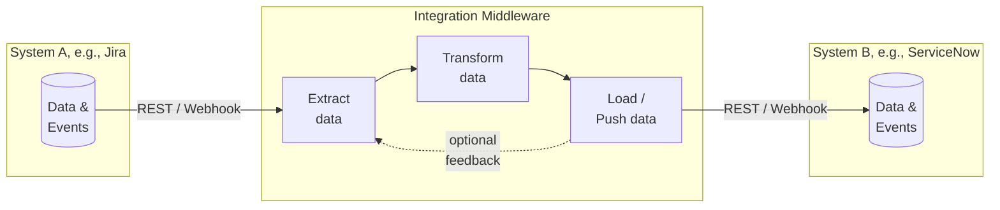
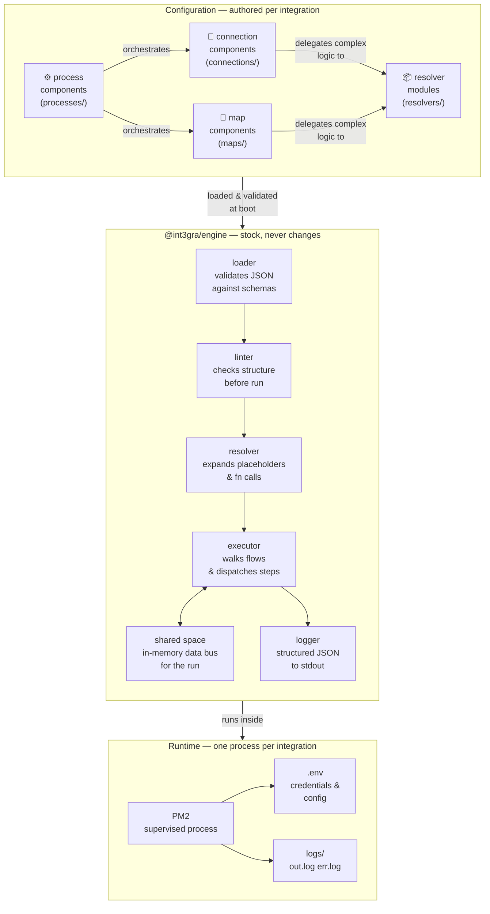

# integra

A configuration-driven integration middleware engine. One instance per integration. No multitenancy. No surprises.

## What is an integration middleware?
 

 
An integration middleware sits between two or more software systems and takes care of the plumbing between them. It speaks to each system in its own language — polling or receiving data from one, transforming it into the shape the other expects, and pushing it across. It handles authentication, retries, error recovery, and logging so that neither system needs to know anything about the other. Without a middleware layer, every integration becomes a one-off script that is hard to observe, harder to maintain, and nearly impossible to reuse.

## Concept

Integra runs integrations as isolated processes. Each integration is a directory containing JSON component files — no code required for common cases, with JS resolver modules available as escape hatches where JSON falls short.

### Three tiers

| Tier | Role |
|---|---|
| `connection` | Talks to a REST API. Reads or writes data. |
| `map` | Reshapes one JSON object into another. |
| `process` | Orchestrates connections and maps via a declarative flow. |


 
Integra's architecture rests on a clean separation between what is **generic** and what is **specific**. The engine is stock — it never changes between integrations. Everything specific to a particular integration lives in JSON component files and JavaScript resolver modules, authored once and loaded at boot. The engine validates, lints, resolves, and executes. It knows nothing about, e.g., ServiceNow or Jira. That knowledge lives entirely in the configuration layer, where it belongs.

### Value syntax

Every value in any component JSON can be:
- **A constant** — `"application/json"`, `true`, `42`
- **A placeholder** — `{{env.MY_VAR}}`, `{{shared.my_key}}`, `{{component.step-id.output.field}}`
- **A function call** — `{{fn:myFunction(arg1, arg2)}}` — resolved by a JS resolver module

---

## Packages

```
packages/
  engine/     — the runtime (@int3gra/engine)
  cli/        — developer tooling (@int3gra/cli)
  manager/    — PM2-based supervisor (@int3gra/manager)
```

---

## Installation

```bash
npm install -g @int3gra/engine @int3gra/cli @int3gra/manager
```

This gives you three global commands: `integra`, `integra-manager`, and `integra-engine`.

**Then, once per host, as root:**

```bash
sudo integra setup
```

This provisions `/opt/integra` — see "Integra home" below. Nothing else
works until this has been run; every command checks for it and fails
immediately, with a clear message, if it's missing.

**To work from source:**

```bash
git clone https://github.com/ciacob/integra.git
cd integra
npm install
cd packages/engine && npm link
cd ../cli          && npm link
cd ../manager      && npm link
sudo integra setup
```

---

## Integra home

`@int3gra/manager`'s `registry.d/` and `.integrations/` live at one fixed
location on the host — integra's "home": **`/opt/integra`**. A literal
constant, not resolved per-platform, not configurable, not relocatable.
integra is a Linux server tool — there is no developer-machine install,
and no honest cross-platform story for a fixed, root-provisioned system
path worth maintaining for a tool nobody runs on Windows or macOS.

**Nothing creates this path automatically.** Run `integra setup` once, by
hand, as root (or via `sudo`), before using any other integra command on
a fresh host:

```bash
sudo integra setup
```

This creates `/opt/integra` (mode `0777` — see below for why), and writes
a minimal `config.json` the first time it runs. It never overwrites an
existing `config.json`, including on repeated runs, so re-running `setup`
is always safe.

Every other command — `integra-manager`'s runtime and registry
subcommands, `integra init`, and `--branch` on `run`/`validate`/`ping`/`test`
— checks that `/opt/integra` exists before doing anything else, and fails
immediately with a clear message (`App was not fully setup, run `integra
setup` as sudo.`) if it doesn't. There is no silent fallback, no lazy
creation on first use.

**The home is fixed — there is no relocation command.** This removes an
entire category of operational risk: there is no migration step, no
question of whether a running integration is pointed at an old location,
nothing to keep in sync. If you genuinely need the underlying storage on
a different disk or mount (a common need — the OS disk is often smaller
than where you'd want `.integrations/` to actually live), the supported
approach is a symlink: point `/opt/integra` at wherever the real storage
lives, set up once, before `integra setup` is ever run on that host.

This is also why `--branch` (see "Git-backed deploy" below) can be run
from any directory — every command resolves the same fixed home rather
than searching for one relative to wherever it happens to be invoked from.

### Filesystem permissions on integra's home

`integra setup` creates `/opt/integra` mode `0777`, owned by whoever ran
it. This is deliberate, not an oversight: integra is built for a team
that already trusts each other with `git push` access to `live/` — a far
more consequential capability than reading or writing a registry entry
or a lock file. The real protections (lock contention, validation gates,
fast-forward-only deploys) live in the command logic and apply regardless
of filesystem permissions; there is no realistic threat model here that
calls for a separate access-control layer on top, and a permissive mode
means no team ever has to fight `EACCES` errors to get work done.

---

## Developer workflow

`integra init` always runs on the server, never on a developer's own
machine — there is no separate developer-machine install. It scaffolds
the integration's real working tree into `.integrations/<id>/live` and
turns it into a git repository immediately. A developer then clones that
repository to their own machine, edits there, and pushes a branch back
into `live/` when ready:

```bash
# On the server
integra init my-sn-jira

# On your own machine — clone directly from live/ (see the generated guide
# for the exact command; it already points back at the right place)
git clone <user>@<host>:/opt/integra/.integrations/my-sn-jira/live my-sn-jira
cd my-sn-jira
cp .env.example .env              # fill in your own credentials, never commit this file
git checkout -b my-patch

# Author your components in connections/, maps/, processes/, resolvers/
# Set the entry process in integra.json

integra validate                  # structural checks — no real systems touched
integra test                      # mock-tested against fixtures — no real systems touched
integra run my-process-id         # a real run, against your own .env

git add -A && git commit -m "..."
git push origin my-patch          # pushes the branch directly into live/
```

Pushing a branch does not affect the running integration by itself — it
only makes that branch exist inside `live/`. Promoting it to production is
a separate, explicit step; see "Git-backed deploy" below for that, and for
how to try out a pushed branch (`--branch`) before asking for a deploy.

---

## Mock-testing (`integra test`)

`integra test` runs your integration end-to-end against fixture files — no real systems are ever called. It is the safe-haven command: nothing can break, nothing can be written to production.

### Fixture structure

`integra init` scaffolds this layout inside every new integration:

```
test/fixtures/
  webhooks/        — inbound payloads fired at listener integrations
  responses/       — outbound response bodies returned by mocked upstream APIs
  .disabled/       — move any fixture here to exclude it from test runs
  .fixture-map.json
  FIXTURES.md      — explains the conventions
```

### Response fixture format

Any `.json` file in `responses/` is a valid response body. Use the optional `_mockStatus` field to set the HTTP status code (default 200); it is stripped before the body reaches your process:

```json
{
  "_mockStatus": 201,
  "result": { "sys_id": "abc", "number": "INC001" }
}
```

### Fixture dispatch rules

| Situation | Behaviour |
|---|---|
| One file in `responses/` | Used for all outbound calls — no map needed |
| Multiple files in `responses/` | `.fixture-map.json` required |
| No files in `responses/` | Error — `integra test` refuses to run |
| No files in `webhooks/` (listener) | Error — `integra test` refuses to run |

### `.fixture-map.json`

Maps outbound request URLs to fixture filenames. Prefix matching — query params are handled automatically:

```json
{
  "https://devxxxxx.service-now.com/api/now/table/incident": "test/fixtures/responses/sn-get-incidents-200.json",
  "https://your-org.atlassian.net/rest/api/3/issue":         "test/fixtures/responses/jira-create-issue-201.json"
}
```

URL not in map → immediate error naming the URL. Fixture file listed but missing → immediate error naming the file.

### Running

```bash
# From the integration directory
integra test
```

For listener integrations, `integra test` starts the real Fastify server, fires every webhook fixture at it in sequence, and reports the HTTP response for each. For outbound integrations, it runs the entry process with all outbound calls intercepted by fixture files.

### The `.disabled/` folder

Move any fixture file into `.disabled/` to exclude it without deleting it. Move it back to re-enable.

### Env file switching

`integra run` and `integra-manager start` accept `--env` to select a specific env file. Defaults to `.env`. This is the recommended way to test against sub-production or staging platforms — same implementation, different credentials:

```bash
integra run my-process-id --env .env.dev
integra-manager start     --env .env.staging
```

The manager's `status` command shows which env file each running integration was started with.

> `integra test` intentionally does not accept `--env` — it never touches real endpoints and has no need for credentials.

---

## Connectivity check (`integra ping`)

Verifies that an integration's remote systems are reachable with the configured credentials — without running any process or fixture.

You provide the check. Create `connections/no-op.json` — a connection component whose request is safe to fire at any time (read-only, no side effects). `integra ping` loads it, resolves auth and endpoint from your env, fires the request, and reports the HTTP status.

```bash
integra ping                                   # fires no-op
integra ping --con sn-get-incident             # fires a specific connection
integra ping --con sn-get-incident,jira-health # fires multiple, in sequence
integra ping --env .env.dev                    # with a specific env file
```

Example output for a multi-connection ping:

```
Pinging 2 connections:

[ sn-get-incident ] Connectivity check — fetches one incident sys_id
  GET https://devxxxxx.service-now.com/api/now/table/incident?sysparm_limit=1
  Authorization: Basic ****
  ✓ HTTP 200 — reachable (143ms)

[ jira-health ] Connectivity check — fetches current Jira user
  GET https://your-org.atlassian.net/rest/api/3/myself
  Authorization: Basic ****
  ✓ HTTP 200 — reachable (89ms)

✓ All 2 connections reachable.
```

### The no-op connection

Name the connection `no-op` — that is the fixed id `integra ping` looks for. If it is absent, the command errors with a clear message and example.

ServiceNow example — fetches one record:

```json
{
  "id":      "no-op",
  "purpose": "read",
  "auth":    { "type": "basic", "user": "{{env.SN_USER}}", "pass": "{{env.SN_PASS}}" },
  "request": {
    "type":     "GET",
    "endpoint": "{{env.SN_BASE_URL}}/api/now/table/incident",
    "headers":  { "Accept": "application/json" },
    "query":    { "sysparm_limit": "1", "sysparm_fields": "sys_id" }
  },
  "resolver": "resolvers/servicenow.js"
}
```

Jira example — fetches the current user (zero side effects):

```json
{
  "id":      "no-op",
  "purpose": "read",
  "auth":    { "type": "basic", "user": "{{env.JIRA_USER}}", "pass": "{{env.JIRA_API_TOKEN}}" },
  "request": {
    "type":     "GET",
    "endpoint": "{{env.JIRA_BASE_URL}}/rest/api/3/myself",
    "headers":  { "Accept": "application/json" }
  }
}
```

The resolver field is only needed if your auth type is `custom`. For `basic`, `api_key`, `bearer`, and `oauth2_client_credentials` the engine handles auth natively — no resolver required.

A 4xx or 5xx response exits with code 1. A network error (DNS, timeout, refused) also exits with code 1 with a clear message. Any 2xx exits with code 0.

---

## Manager workflow

The manager stores integration metadata as a directory of fragments —
`registry.d/<id>.registry.json`, one file per integration — instead of a
single shared `registry.json`. This exists so that multiple engineers
working on different integrations on the same host never race on the same
file, and so that one person's typo can't corrupt everyone else's config.

**`registry.d/` is system-managed. Never hand-edit the files inside it.**
Treat it like a `dist/` folder — inspectable, but not where you make changes.
All mutation goes through five subcommands:

```bash
integra-manager checkout <id>             # lock <id>, get an editable staged copy
# ...edit the staged file (in ~/integra/ by default)...
integra-manager publish <id>              # validate, publish live, release the lock

integra-manager uncheckout <id>           # give up without publishing
integra-manager delete <id> [--purge]     # remove an entry (--purge also deletes its folder)
integra-manager duplicate <id> <new-id>   # clone an entry + its integration folder
```

There is no separate "create" command for registry entries. `integra init
<path>` (run by the developer, not the manager) is the one creation path —
it scaffolds the integration's real working tree directly into
`.integrations/<id>/live`, turns that into a git repository, and registers
it in `registry.d/` in the same step. `checkout` is edit-only: it refuses
outright on an id that isn't already registered, rather than silently
seeding a template — a typo'd id should be a clear error, not a ghost
entry. See "Git-backed deploy" below for the full picture of how
`.integrations/<id>/live` fits together with `init`, `deploy`, and `undeploy`.

**Locks are exclusive and time-boxed** (30 minutes by default). Only the
user who acquired a lock may publish or uncheckout against it — unless it
has expired, in which case anyone's next checkout succeeds as if the lock
had never existed. This means a forgotten checkout can never permanently
block an integration, while a live edit session is genuinely protected from
someone else publishing over it mid-edit.

Once an integration is registered, the runtime commands work exactly as
before:

```bash
integra-manager start              # spawn all enabled integrations via PM2
integra-manager status             # show uptime, restarts, memory
integra-manager logs my-sn-jira    # tail logs for a specific integration
integra-manager stop my-sn-jira    # stop an integration
integra-manager restart my-sn-jira
integra-manager enable my-sn-jira  # flips one field — still respects locks
integra-manager disable my-sn-jira
```

`enable`/`disable` internally perform their own checkout → edit → publish
cycle, so they're correctly rejected if someone else currently holds a live
lock on that integration — they are not a backdoor around the lock layer.

---

## Git-backed deploy

`integra init <path>` scaffolds an integration's real working tree directly
into `.integrations/<id>/live` — not at `<path>` itself — and turns it into
a git repository immediately. At that moment there is no `.env` yet, so
there is nothing sensitive in the repository; this is what makes it safe
to do unconditionally, for every integration, from the very first second
it exists.

```
.integrations/<id>/
  live/     ← what PM2 runs and what `deploy`/`undeploy` operate on
  tests/    ← ephemeral, content-addressed archives used by --branch (see below)
```

`<path>` itself receives only a generated guide — `<id>.guide.md` — with
the clone command for this host, a dev workflow, and a command reference.
It is not where development happens, and integra has no opinion on where a
developer's own clone ends up; that's intentionally not integra's business.

**`live/` IS the repository — it has no remote of its own and never
fetches from anywhere.** A developer clones it directly
(`git clone <user>@<host>:<liveDir>`), which, by git's own default
behaviour, gives their clone an `origin` pointing back at `live/` — no
configuration needed on integra's part. They push branches *into* `live/`
itself. From that moment, the branch is an ordinary local branch inside
`live/`'s own history — there's no separate hosting service, no fetch
step, anywhere in the picture.

**`live/` is never hand-edited, the same way `registry.d/` never is.**
Pushing a branch into it does not by itself affect the running
integration — it just makes that branch exist there. Promotion is
explicit:

```bash
integra-manager deploy my-sn-jira --branch my-patch   # fast-forward + restart
```

**Push access** to `live/` is an SSH/filesystem-permissions question, not
something integra brokers — if a developer can SSH into the host, the
assumption is they can push.

### Fast-forward only

`deploy` merges the named branch — already pushed into `live/` — with
`git merge --ff-only`, a plain local merge. If it doesn't fast-forward
cleanly — `live/` has diverged, usually because of a direct edit that was
never pushed as a branch — the deploy is refused outright and **`live/` is
left exactly as it was**. This is deliberate: a deploy command that can
leave a production host in a half-merged state, unattended, is worse than
one that simply refuses. Resolve the divergence in your own clone, push,
and try again.

### Rollback

```bash
integra-manager undeploy my-sn-jira
integra-manager deploy-history my-sn-jira -n 5
```

Each successful deploy is recorded as an annotated git tag (`deploy-<n>`)
whose own message — not the underlying commit's message, which belongs to
the developer, not to the deploy — records the branch, who deployed, and
when. `undeploy` moves `live/` to the deploy tag before the current one,
**never `HEAD~1`** — `HEAD~1` only means "the previous deploy" if every
single commit in `live/`'s history happens to be exactly one deploy, an
assumption a single direct commit breaks. Tags name deploys explicitly, so
rollback is correct regardless of what else has touched the repository.
`deploy-history` is built entirely from these same tags — no separate
bookkeeping file.

### Trying a branch without deploying — `--branch`

`run`, `validate`, `ping`, and `test` all accept `--branch <name>`:

```bash
integra test                                          # live/, mocked, as always
integra test     --branch my-patch                    # that branch, mocked — no --env needed
integra validate --branch my-patch                    # structural checks only — no --env needed
integra run      <process-id> --branch my-patch --env .env.dev
integra ping      --branch my-patch --env .env.dev
```

**`--branch` requires `--env`** on `run` and `ping`, which read real
credentials and environment values — but not on `test` or `validate`,
neither of which ever reads `process.env` or touches a real system.
`validate` only inspects JSON shape and lints process structure;
`{{env.X}}` placeholders are resolved later, at execution time, not during
validation. Requiring `--env` where it does nothing would just be
ceremony. Where it *is* required, it's deliberate: without it, the obvious
failure mode is testing a patch branch and silently falling back to
default `.env` — which, for a long-lived integration, is very plausibly
production credentials.

**Push your branch into `live/` before you `--branch`.** These commands
always read the branch as it exists in `live/`'s own history — there is no
fetch step, so a branch that only exists in your own uncommitted clone
isn't visible to them yet.

**This is the normal way to try out your own work.** integra only ever
runs on the server — there's no separate developer-machine install. So the
usual flow is: push your branch into `live/`, then from the same server,
run `integra test --branch my-patch` (or `run`/`validate`/`ping`) to verify
it before asking for `integra-manager deploy`. **`--branch` can be run from
any directory** — there is no need to `cd` into the integration's `live/`
tree, or anywhere else in particular, first. The integration's registry
entry and `.integrations/` tree are found by reading integra's fixed home
directory (see "Integra home" below), not by searching upward from wherever
the command happens to be invoked.

**Listener integrations are the one case worth a second look.** `integra
run --branch X` against a listener starts a real, resident Fastify server
that PM2 does not manage. It keeps running until you stop it yourself.

Each distinct branch state is archived once into
`.integrations/<id>/tests/<commit-sha>/` — content-addressed by commit, not
by time, so a second request for an unchanged branch reuses the existing
archive instead of re-archiving. A background sweep (started automatically
the first time it's needed, and stopped automatically once there's nothing
left to do) reclaims archive folders that haven't been touched in two
hours — a fixed safety net for abandoned runs, not a tuning knob.

---

## Example

See `example-sn-jira/` for a full working example that syncs open incidents from ServiceNow to Jira.

```bash
cd example-sn-jira
cp .env.example .env
# Fill in your credentials
integra validate
integra run sync-incident-sn-to-jira
```

---

## Component reference

### Connection

```json
{
  "id": "my-connection",
  "purpose": "read | write | readwrite",
  "request": {
    "type": "GET | POST | PUT | PATCH | DELETE",
    "endpoint": "{{env.BASE_URL}}/path/{{input.id}}",
    "headers": { "Authorization": "{{fn:basicAuth(env.USER, env.PASS)}}" },
    "query": { "limit": "10" },
    "body": "{{shared.payload}}"
  },
  "filter": "{{fn:myFilter(output)}}",
  "output": "{{fn:store('my_key')}}",
  "resolver": "resolvers/my-resolver.js"
}
```

### Map

```json
{
  "id": "my-map",
  "input": "{{shared.source_data}}",
  "output": "{{fn:store('target_data')}}",
  "defaults": { "field": "default_value" },
  "overrides": { "field": "forced_value" },
  "transformation": {
    "base": "{{fn:myTransform(input)}}",
    "defaults": { "source.field": "target.field" },
    "overrides": { "source.other": "target.other" }
  },
  "resolver": "resolvers/my-resolver.js"
}
```

### Process

```json
{
  "id": "my-process",
  "flow": {
    "metadata": { "parallel": false },
    "steps": [
      { "id": "step-1", "component": "my-connection", "onError": "{{fn:handleError(error)}}" },
      { "if": "{{fn:condition(shared.data)}}", "steps": [ { "component": "my-map" } ] },
      { "else": null, "steps": [] },
      {
        "id": "my-loop",
        "while": "{{fn:hasMore(shared)}}",
        "steps": [
          { "component": "my-map" },
          { "if": "{{fn:shouldBreak(shared)}}", "steps": [ { "break": "my-loop" } ] }
        ]
      },
      {
        "switch": "{{shared.status}}",
        "cases": {
          "open":    { "steps": [ { "component": "handle-open" } ] },
          "closed":  { "steps": [ { "component": "handle-closed" } ] },
          "default": { "steps": [ { "component": "handle-unknown" } ] }
        }
      }
    ]
  }
}
```

---

## Authentication

The engine resolves authentication before every HTTP request. Declare an `auth` block on any connection component — no resolver code needed for the following natively supported schemes.

### Supported types

**`basic`** — HTTP Basic Auth.
```json
"auth": {
  "type": "basic",
  "user": "{{env.API_USER}}",
  "pass": "{{env.API_PASS}}"
}
```

**`api_key`** — single header key.
```json
"auth": {
  "type": "api_key",
  "header": "X-API-Key",
  "value": "{{env.MY_API_KEY}}"
}
```

**`bearer`** — static Bearer token.
```json
"auth": {
  "type": "bearer",
  "token": "{{env.MY_TOKEN}}"
}
```

**`oauth2_client_credentials`** — full token lifecycle managed by the engine: fetches on first use, persists to `storage/store.json`, refreshes automatically before expiry.
```json
"auth": {
  "type":          "oauth2_client_credentials",
  "token_url":     "{{env.TOKEN_URL}}",
  "client_id":     "{{env.CLIENT_ID}}",
  "client_secret": "{{env.CLIENT_SECRET}}",
  "scope":         "api",
  "token_buffer":  60,
  "on_401":        "refresh_and_retry"
}
```

`token_buffer` (default 60) is the number of seconds before true expiry at which the engine pre-emptively refreshes — preventing mid-run 401s under normal conditions. `on_401: "refresh_and_retry"` adds a single automatic retry for the edge case where a token is revoked externally.

**`custom`** — defers entirely to a resolver function that returns a headers object.
```json
"auth": {
  "type":     "custom",
  "resolver": "{{fn:myAuthFn}}"
}
```

### `authUtilities.js`

The engine exposes its internal auth helpers as a public utility module. Import them in your resolver modules for consistent, tested implementations:

```javascript
import {
  buildBasicAuthHeader,
  buildApiKeyHeader,
  buildBearerHeader,
  isTokenExpired,
  fetchClientCredentialsToken,
  getOrRefreshToken,
} from "@int3gra/engine/authUtilities";
```

Use `getOrRefreshToken` when you need OAuth CC logic inside a `custom` resolver — it handles expiry checks, fetching, and persistence in one call. All functions accept injectable dependencies (`fetchFn`, `nowMs`) so they are straightforwardly unit-testable.

### Token storage

Tokens are persisted to `<integration>/storage/store.json` between runs. This file is owned by the engine — do not commit it. Add `storage/` to your `.gitignore`.

> **Out of scope:** OAuth 2.0 Authorization Code flow (requires a human redirect at setup time). The `custom` type and `authUtilities.js` are available for implementers who need to work around this.

---

## Inbound integrations (listener lifecycle)

By default integra integrations are outbound — they fetch or push data on a schedule or on demand. For systems that push *to you* (webhooks), integra supports a `listener` lifecycle: a long-lived Fastify HTTP server that fires your entry process on each valid inbound request.

### Declaring a listener integration

Set `lifecycle: "listener"` in `integra.json` and add an `httpServer` block:

```json
{
  "id":         "jira-inbound",
  "lifecycle":  "listener",
  "entry":      "handle-jira-event",
  "sendResult": false,
  "httpServer": {
    "port":   3000,
    "host":   "0.0.0.0",
    "path":   "/hooks/jira",
    "method": "POST",
    "auth": {
      "type":   "hmac",
      "header": "X-Hub-Signature-256",
      "secret": "{{env.JIRA_WEBHOOK_SECRET}}"
    },
    "validation": "schemas/jira-event.json"
  }
}
```

`httpServer` holds only HTTP server configuration — port, path, auth, and an optional JSON Schema path for payload validation. The entry process and response behaviour live at the top level alongside `entry`.

### How the entry process receives the request

The request body is injected as the process `input`. Inside your process and resolvers, `ctx.input` (or `{{input.fieldName}}` in JSON) contains the parsed webhook payload. The process doesn't know it was triggered by a webhook — it just has input and runs normally.

### Responding to the caller

`sendResult: false` (default) — the listener responds `202 Accepted` immediately and fires the process in the background. The sender considers the event delivered and will not retry. If the process fails, a structured error is written to the integration log — a process failure is a bug to fix, not a condition to retry around.

`sendResult: true` — the listener awaits the process result and sends the HTTP response from it. The process writes to `shared.http_response`:

```javascript
// in a resolver
export function buildResponse(ctx) {
  ctx._shared.set("http_response", {
    status: 200,
    body:   { ok: true, id: ctx._shared.get("created_id") },
  });
}
```

If `http_response` is absent, the listener falls back to `200 OK`. Use `sendResult: true` when the sender must receive a non-2xx to trigger its own retry — for example, Jira will retry a webhook delivery only if it receives a 5xx response. In that case a process failure causes the listener to respond `500`, and Jira retries automatically.

### Inbound authentication

Two schemes are supported natively in `httpServer.auth`:

**`hmac`** — verifies the request signature using a shared secret. Standard for Jira, GitHub, and most webhook senders. The `header` field names the signature header; `algorithm` defaults to `sha256`.

**`bearer_token`** — checks the `Authorization: Bearer <token>` header against a static token.

For anything else, omit `auth` and handle verification in your entry process resolver.

### HMAC utilities

`verifyHmacSignature` is exported from `authUtilities.js` for use in custom resolver logic:

```javascript
import { verifyHmacSignature } from "@int3gra/engine/authUtilities";

export function myCustomAuth(ctx) {
  const raw = ctx.input.__rawBody;
  const sig = ctx.input.__headers["x-my-signature"];
  return verifyHmacSignature(raw, sig, ctx.env.MY_SECRET);
}
```

### Lifecycle and PM2

A listener integration runs as a long-lived supervised process (`autorestart: true`). The manager commands are lifecycle-aware — `stop`, `restart`, `enable`, and `disable` all do the right thing without any extra flags:

```bash
integra-manager stop    jira-inbound   # stops the Fastify process
integra-manager restart jira-inbound   # restarts it (Fastify comes back up)
integra-manager disable jira-inbound   # stops it and marks it disabled
```

A built-in `/_health` endpoint is always available at the configured port regardless of the `path` setting.

---

## Query parameters

### Outbound connections

Declare a `query` object inside `request`. Every value is resolved through the normal placeholder and function-call syntax before being appended to the URL as query string parameters.

```json
"request": {
  "type":     "GET",
  "endpoint": "{{env.SN_BASE_URL}}/api/now/table/incident",
  "query": {
    "sysparm_limit":  "10",
    "sysparm_fields": "number,state,priority",
    "state":          "{{input.state}}",
    "tag":            "{{fn:buildTagFilter}}"
  }
}
```

Null and undefined values are skipped automatically. All other values are coerced to strings. For multi-value parameters (e.g. `field=a&field=b`), build the string in a resolver function and pass a single value.

### Inbound listener

When a webhook sender appends query parameters to the URL, the listener exposes them in the process input under `input.query`. The full inbound input envelope is:

```
input.payload   — parsed JSON body
input.query     — query string parameters
input.headers   — all request headers
input.rawBody   — raw body bytes (Buffer), useful for custom HMAC verification
```

Access them in process JSON or resolver functions as usual:

```json
"if": "{{fn:isValidSource(input.query.source)}}"
```

```javascript
export function isValidSource(ctx, source) {
  return source === "jira-prod";
}
```

Optionally validate query params against a JSON Schema before the process fires — the listener responds `400` if validation fails, the process never runs:

```json
"httpServer": {
  "path":            "/hooks/jira",
  "validation":      "schemas/jira-body.json",
  "queryValidation": "schemas/jira-query.json"
}
```

---

## Binary content transfer

Connection components support non-JSON request and response bodies via two optional root fields: `body_type` and `response_type`. Both default to `json` when absent.

### Downloading a file (`response_type: "binary"`)

The engine calls `arrayBuffer()` instead of `json()` on the response, parses metadata from response headers, and exposes the result to the output resolver as:

```
ctx.output.buffer          — raw Buffer (in-memory, not serialised to shared space)
ctx.output.meta            — serialisable: { file_name, content_type, size, hash }
ctx.output.idempotency_key — extracted from meta using the dot-path in binary_info.idempotency_key
```

```json
{
  "id":            "sn-get-attachment",
  "response_type": "binary",
  "binary_info": {
    "idempotency_key": "hash"
  },
  "request": {
    "type":     "GET",
    "endpoint": "{{env.SN_BASE_URL}}/api/now/attachment/{{input.sys_id}}/file",
    "headers":  { "Accept": "*/*" }
  },
  "output":   "{{fn:snStoreAttachment}}",
  "resolver": "resolvers/attachments.js"
}
```

### Uploading raw binary (`body_type: "binary"`)

The engine sends the buffer directly with the declared `Content-Type`. `request.body` is ignored.

```json
{
  "id":        "sn-post-attachment",
  "body_type": "binary",
  "binary_info": {
    "source_bytes": "{{shared.attachment_buffer}}",
    "content_type": "{{input.mime_type}}",
    "file_name":    "{{input.file_name}}"
  },
  "request": {
    "type":     "POST",
    "endpoint": "{{env.SN_BASE_URL}}/api/now/attachment/file",
    "query": {
      "table_name":   "{{input.table_name}}",
      "table_sys_id": "{{input.sys_id}}",
      "file_name":    "{{input.file_name}}"
    }
  }
}
```

### Uploading multipart form data (`body_type: "multipart"`)

The engine builds a `FormData` body. Metadata `fields` are appended first, the file last — as required by ServiceNow, Jira, and most multipart endpoints. `Content-Type` including the boundary is set automatically by `fetch`.

```json
{
  "id":        "sn-upload-multipart",
  "body_type": "multipart",
  "binary_info": {
    "source_bytes": "{{shared.attachment_buffer}}",
    "content_type": "{{input.mime_type}}",
    "file_name":    "{{input.file_name}}",
    "file_field":   "file",
    "fields":       "{{shared.attachment_metadata}}"
  },
  "request": {
    "type":     "POST",
    "endpoint": "{{env.SN_BASE_URL}}/api/now/attachment/upload"
  }
}
```

### `binaryUtilities.js`

Importable utilities for resolver authors. The two delegatees cover the vast majority of attachment handling:

```javascript
import {
  receiveAttachment,        // inbound: idempotency check → write to disk → return record
  prepareAttachmentUpload,  // outbound: read from disk → detect MIME → return upload-ready object
  buildMultipartFields,     // pure: builds the fields object for a multipart upload
  detectMimeType,           // async: magic-byte detection via file-type library
  writeBufferToDisk,        // writes a Buffer to disk, skips if file exists (overwrite: false)
  readFileAsBuffer,         // reads a file into a Buffer
  parseResponseMeta,        // extracts attachment metadata from response headers
  checkIdempotency,         // pure: checks a registry object for a known key
  registerIdempotency,      // pure: returns a new registry with the key added
} from "@int3gra/engine/binaryUtilities";
```

A complete inbound resolver using the delegatee:

```javascript
import { receiveAttachment } from "@int3gra/engine/binaryUtilities";

export async function snStoreAttachment(ctx) {
  const record = await receiveAttachment(ctx, { dir: "attachments" });
  ctx._shared.set("attachment", record);   // serialisable — safe to store
  return record;
}
```

A complete outbound resolver:

```javascript
import { prepareAttachmentUpload, buildMultipartFields } from "@int3gra/engine/binaryUtilities";

export async function snPrepareUpload(ctx) {
  const upload = await prepareAttachmentUpload(ctx);
  ctx._shared.set("attachment_buffer",   upload.buffer);
  ctx._shared.set("attachment_metadata", buildMultipartFields(upload, {
    table_name:   ctx.env.SN_TABLE,
    table_sys_id: ctx.input.record_sys_id,
  }));
}
```

### Idempotency

When `binary_info.idempotency_key` is set, the engine extracts the named field from response metadata and exposes it as `ctx.output.idempotency_key`. `receiveAttachment` checks this key against a per-run registry in shared space and skips the disk write if the content has already been processed — useful when a process iterates over attachments and the same file appears more than once.

For platforms that provide a stable content hash in metadata (ServiceNow's `hash` field, for example), set `"idempotency_key": "hash"` and identical files are automatically deduplicated within a run.

> MIME type detection uses the [`file-type`](https://github.com/sindresorhus/file-type) library (magic bytes). Add `storage/` and `attachments/` to your `.gitignore`.

---

## Pagination

Integra has no declarative pagination support and no pagination utility library. Pagination patterns vary too much across APIs for a shared abstraction to be useful — offset, cursor, link-header, embedded `next` URLs, and GraphQL `pageInfo` are all structurally different. A library that covers some of them would just be a collection of examples, and one that tried to cover all of them would be a configuration burden nobody wants.

The `while` loop is already the right primitive. Pagination is a resolver concern.

### The pattern

A resolver function manages the page state in shared space. The `while` condition calls it; it fetches the next page URL or offset, returns `true` while there is more data, `false` when done.

The `example-sn-jira` integration demonstrates this with a queue-based approach: the first connection fetch returns all results, a resolver initialises a queue in shared space, and the `while` loop drains it one item at a time. Adapt this for your API's specific pagination scheme.

For APIs that paginate the fetch itself — where each connection call returns one page and you need to loop over pages — the pattern is:

```javascript
// resolvers/my-api.js

export function hasNextPage(ctx) {
  // Store whatever your API returns as the "next page" indicator
  // e.g. a cursor, an offset, a full URL — your choice
  return !!ctx._shared.get("next_page_cursor");
}

export function prepareNextPage(ctx) {
  // Move the cursor into the connection's input for the next iteration
  ctx._shared.set("page_cursor", ctx._shared.get("next_page_cursor"));
}

export function extractPageCursor(ctx) {
  // Called as the connection's output fn — extracts the next cursor from the response
  const next = ctx.output?.result?.nextPageToken ?? null;
  ctx._shared.set("next_page_cursor", next);
  ctx._shared.set("page_results", [
    ...(ctx._shared.get("page_results") ?? []),
    ...(ctx.output?.result?.items ?? []),
  ]);
  return ctx.output;
}
```

```json
{
  "id": "my-process",
  "flow": {
    "steps": [
      { "id": "first-page", "component": "my-api-fetch" },
      {
        "id": "page-loop",
        "while": "{{fn:hasNextPage}}",
        "steps": [
          { "component": "prepare-next-page-map" },
          { "component": "my-api-fetch" }
        ]
      }
    ]
  }
}
```

The accumulation of results across pages — `[...existing, ...newItems]` — is plain JavaScript. There is nothing to import.

---

## Resolver naming convention

When an integration has multiple resolver modules, prefix each module's
exported functions with a short namespace to avoid flat-namespace collisions:

```javascript
// resolvers/servicenow.js
export function snStore(ctx, key) { ... }
export function snHasResults(ctx) { ... }

// resolvers/jira.js
export function jiraStore(ctx, key) { ... }
export function jiraBasicAuth(ctx, user, token) { ... }
```

---

## License

Licensed under the [Business Source License 1.1](./LICENSE).

Free to use commercially and as part of services or products you build —
**integra itself may not be the product being sold or offered.** See
[NOTICE](./NOTICE) for a plain-English summary.

**Change Date:** 2030/12/31 — on that date this version converts to
[Apache License 2.0](https://www.apache.org/licenses/LICENSE-2.0).
