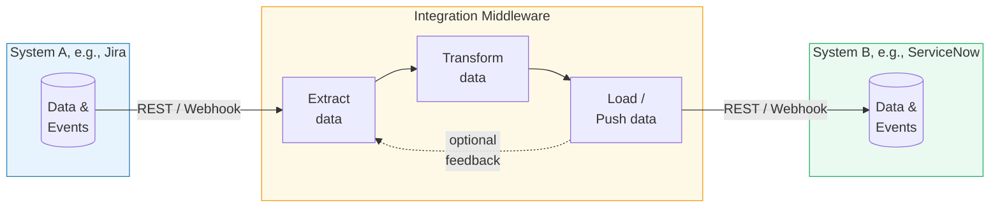
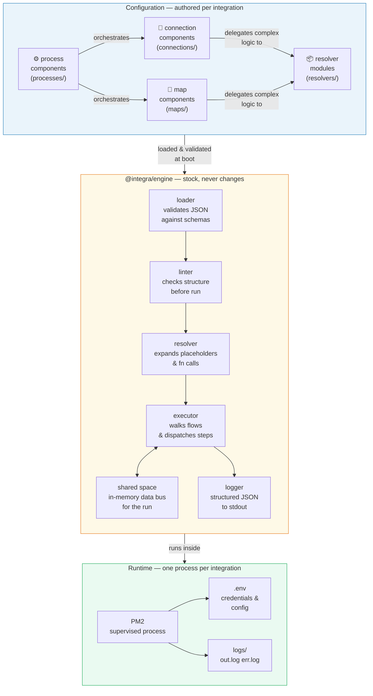

# integra

A configuration-driven integration middleware engine. One instance per integration. No multitenancy. No surprises.

## What is an integration middleware?
 

 
An integration middleware sits between two or more software systems and takes care of the plumbing between them. It speaks to each system in its own language — polling or receiving data from one, transforming it into the shape the other expects, and pushing it across. It handles authentication, retries, error recovery, and logging so that neither system needs to know anything about the other. Without a middleware layer, every integration becomes a one-off script that is hard to observe, harder to maintain, and nearly impossible to reuse.

## Concept

Integra runs integrations as isolated processes. Each integration is a directory containing JSON component files — no code required for common cases, with JS resolver modules available as escape hatches where JSON falls short.

### Three tiers

| Tier | Role |
|---|---|
| `connection` | Talks to a REST API. Reads or writes data. |
| `map` | Reshapes one JSON object into another. |
| `process` | Orchestrates connections and maps via a declarative flow. |


 
Integra's architecture rests on a clean separation between what is **generic** and what is **specific**. The engine is stock — it never changes between integrations. Everything specific to a particular integration lives in JSON component files and JavaScript resolver modules, authored once and loaded at boot. The engine validates, lints, resolves, and executes. It knows nothing about, e.g., ServiceNow or Jira. That knowledge lives entirely in the configuration layer, where it belongs.

### Value syntax

Every value in any component JSON can be:
- **A constant** — `"application/json"`, `true`, `42`
- **A placeholder** — `{{env.MY_VAR}}`, `{{shared.my_key}}`, `{{component.step-id.output.field}}`
- **A function call** — `{{fn:myFunction(arg1, arg2)}}` — resolved by a JS resolver module

---

## Packages

```
packages/
  engine/     — the runtime (@integra/engine)
  cli/        — developer tooling (@integra/cli)
  manager/    — PM2-based supervisor (@integra/manager)
```

---

## Installation

> **Note:** These packages are not yet published to npm.  
> Once published, you'll be able to install globally with:
> ```bash
> npm install -g @integra/engine @integra/cli @integra/manager
> ```

**For now, clone and install locally:**

```bash
# Clone the repository
git clone https://github.com/ciacob/integra.git
cd integra

# Install dependencies and link packages
npm install
npm run bootstrap  # if using lerna/workspaces, or manually link:

# Link packages globally
cd packages/engine && npm link
cd ../cli && npm link
cd ../manager && npm link
```

---

## Developer workflow

```bash
# Scaffold a new integration
integra init my-sn-jira
cd my-sn-jira

# Copy and fill in your credentials
cp .env.example .env

# Author your components in connections/, maps/, processes/, resolvers/
# Set the entry process in integra.json

# Validate structure and schemas without running
integra validate

# Run a process locally
integra run my-process-id
```

---

## Manager workflow

From the directory containing `registry.json`:

```bash
integra-manager start              # spawn all enabled integrations via PM2
integra-manager status             # show uptime, restarts, memory
integra-manager logs my-sn-jira   # tail logs for a specific integration
integra-manager stop my-sn-jira   # stop an integration
integra-manager restart my-sn-jira
integra-manager enable my-sn-jira
integra-manager disable my-sn-jira
```

---

## Example

See `example-sn-jira/` for a full working example that syncs open incidents from ServiceNow to Jira.

```bash
cd example-sn-jira
cp .env.example .env
# Fill in your credentials
integra validate
integra run sync-incident-sn-to-jira
```

---

## Component reference

### Connection

```json
{
  "id": "my-connection",
  "purpose": "read | write | readwrite",
  "request": {
    "type": "GET | POST | PUT | PATCH | DELETE",
    "endpoint": "{{env.BASE_URL}}/path/{{input.id}}",
    "headers": { "Authorization": "{{fn:basicAuth(env.USER, env.PASS)}}" },
    "query": { "limit": "10" },
    "body": "{{shared.payload}}"
  },
  "filter": "{{fn:myFilter(output)}}",
  "output": "{{fn:store('my_key')}}",
  "resolver": "resolvers/my-resolver.js"
}
```

### Map

```json
{
  "id": "my-map",
  "input": "{{shared.source_data}}",
  "output": "{{fn:store('target_data')}}",
  "defaults": { "field": "default_value" },
  "overrides": { "field": "forced_value" },
  "transformation": {
    "base": "{{fn:myTransform(input)}}",
    "defaults": { "source.field": "target.field" },
    "overrides": { "source.other": "target.other" }
  },
  "resolver": "resolvers/my-resolver.js"
}
```

### Process

```json
{
  "id": "my-process",
  "flow": {
    "metadata": { "parallel": false },
    "steps": [
      { "id": "step-1", "component": "my-connection", "onError": "{{fn:handleError(error)}}" },
      { "if": "{{fn:condition(shared.data)}}", "steps": [ { "component": "my-map" } ] },
      { "else": null, "steps": [] },
      {
        "id": "my-loop",
        "while": "{{fn:hasMore(shared)}}",
        "steps": [
          { "component": "my-map" },
          { "if": "{{fn:shouldBreak(shared)}}", "steps": [ { "break": "my-loop" } ] }
        ]
      }
    ]
  }
}
```

---

## Authentication

The engine resolves authentication before every HTTP request. Declare an `auth` block on any connection component — no resolver code needed for the following natively supported schemes.

### Supported types

**`basic`** — HTTP Basic Auth.
```json
"auth": {
  "type": "basic",
  "user": "{{env.API_USER}}",
  "pass": "{{env.API_PASS}}"
}
```

**`api_key`** — single header key.
```json
"auth": {
  "type": "api_key",
  "header": "X-API-Key",
  "value": "{{env.MY_API_KEY}}"
}
```

**`bearer`** — static Bearer token.
```json
"auth": {
  "type": "bearer",
  "token": "{{env.MY_TOKEN}}"
}
```

**`oauth2_client_credentials`** — full token lifecycle managed by the engine: fetches on first use, persists to `storage/store.json`, refreshes automatically before expiry.
```json
"auth": {
  "type":          "oauth2_client_credentials",
  "token_url":     "{{env.TOKEN_URL}}",
  "client_id":     "{{env.CLIENT_ID}}",
  "client_secret": "{{env.CLIENT_SECRET}}",
  "scope":         "api",
  "token_buffer":  60,
  "on_401":        "refresh_and_retry"
}
```

`token_buffer` (default 60) is the number of seconds before true expiry at which the engine pre-emptively refreshes — preventing mid-run 401s under normal conditions. `on_401: "refresh_and_retry"` adds a single automatic retry for the edge case where a token is revoked externally.

**`custom`** — defers entirely to a resolver function that returns a headers object.
```json
"auth": {
  "type":     "custom",
  "resolver": "{{fn:myAuthFn}}"
}
```

### `authUtilities.js`

The engine exposes its internal auth helpers as a public utility module. Import them in your resolver modules for consistent, tested implementations:

```javascript
import {
  buildBasicAuthHeader,
  buildApiKeyHeader,
  buildBearerHeader,
  isTokenExpired,
  fetchClientCredentialsToken,
  getOrRefreshToken,
} from "@integra/engine/authUtilities";
```

Use `getOrRefreshToken` when you need OAuth CC logic inside a `custom` resolver — it handles expiry checks, fetching, and persistence in one call. All functions accept injectable dependencies (`fetchFn`, `nowMs`) so they are straightforwardly unit-testable.

### Token storage

Tokens are persisted to `<integration>/storage/store.json` between runs. This file is owned by the engine — do not commit it. Add `storage/` to your `.gitignore`.

> **Out of scope:** OAuth 2.0 Authorization Code flow (requires a human redirect at setup time). The `custom` type and `authUtilities.js` are available for implementers who need to work around this.

---

## Inbound integrations (listener lifecycle)

By default integra integrations are outbound — they fetch or push data on a schedule or on demand. For systems that push *to you* (webhooks), integra supports a `listener` lifecycle: a long-lived Fastify HTTP server that fires your entry process on each valid inbound request.

### Declaring a listener integration

Set `lifecycle: "listener"` in `integra.json` and add an `httpServer` block:

```json
{
  "id":         "jira-inbound",
  "lifecycle":  "listener",
  "entry":      "handle-jira-event",
  "sendResult": false,
  "httpServer": {
    "port":   3000,
    "host":   "0.0.0.0",
    "path":   "/hooks/jira",
    "method": "POST",
    "auth": {
      "type":   "hmac",
      "header": "X-Hub-Signature-256",
      "secret": "{{env.JIRA_WEBHOOK_SECRET}}"
    },
    "validation": "schemas/jira-event.json"
  }
}
```

`httpServer` holds only HTTP server configuration — port, path, auth, and an optional JSON Schema path for payload validation. The entry process and response behaviour live at the top level alongside `entry`.

### How the entry process receives the request

The request body is injected as the process `input`. Inside your process and resolvers, `ctx.input` (or `{{input.fieldName}}` in JSON) contains the parsed webhook payload. The process doesn't know it was triggered by a webhook — it just has input and runs normally.

### Responding to the caller

`sendResult: false` (default) — the listener responds `202 Accepted` immediately and fires the process in the background. The sender considers the event delivered and will not retry. If the process fails, a structured error is written to the integration log — a process failure is a bug to fix, not a condition to retry around.

`sendResult: true` — the listener awaits the process result and sends the HTTP response from it. The process writes to `shared.http_response`:

```javascript
// in a resolver
export function buildResponse(ctx) {
  ctx._shared.set("http_response", {
    status: 200,
    body:   { ok: true, id: ctx._shared.get("created_id") },
  });
}
```

If `http_response` is absent, the listener falls back to `200 OK`. Use `sendResult: true` when the sender must receive a non-2xx to trigger its own retry — for example, Jira will retry a webhook delivery only if it receives a 5xx response. In that case a process failure causes the listener to respond `500`, and Jira retries automatically.

### Inbound authentication

Two schemes are supported natively in `httpServer.auth`:

**`hmac`** — verifies the request signature using a shared secret. Standard for Jira, GitHub, and most webhook senders. The `header` field names the signature header; `algorithm` defaults to `sha256`.

**`bearer_token`** — checks the `Authorization: Bearer <token>` header against a static token.

For anything else, omit `auth` and handle verification in your entry process resolver.

### HMAC utilities

`verifyHmacSignature` is exported from `authUtilities.js` for use in custom resolver logic:

```javascript
import { verifyHmacSignature } from "@integra/engine/authUtilities";

export function myCustomAuth(ctx) {
  const raw = ctx.input.__rawBody;
  const sig = ctx.input.__headers["x-my-signature"];
  return verifyHmacSignature(raw, sig, ctx.env.MY_SECRET);
}
```

### Lifecycle and PM2

A listener integration runs as a long-lived supervised process (`autorestart: true`). The manager commands are lifecycle-aware — `stop`, `restart`, `enable`, and `disable` all do the right thing without any extra flags:

```bash
integra-manager stop    jira-inbound   # stops the Fastify process
integra-manager restart jira-inbound   # restarts it (Fastify comes back up)
integra-manager disable jira-inbound   # stops it and marks it disabled
```

A built-in `/_health` endpoint is always available at the configured port regardless of the `path` setting.

---

## Query parameters

### Outbound connections

Declare a `query` object inside `request`. Every value is resolved through the normal placeholder and function-call syntax before being appended to the URL as query string parameters.

```json
"request": {
  "type":     "GET",
  "endpoint": "{{env.SN_BASE_URL}}/api/now/table/incident",
  "query": {
    "sysparm_limit":  "10",
    "sysparm_fields": "number,state,priority",
    "state":          "{{input.state}}",
    "tag":            "{{fn:buildTagFilter}}"
  }
}
```

Null and undefined values are skipped automatically. All other values are coerced to strings. For multi-value parameters (e.g. `field=a&field=b`), build the string in a resolver function and pass a single value.

### Inbound listener

When a webhook sender appends query parameters to the URL, the listener exposes them in the process input under `input.query`. The full inbound input envelope is:

```
input.payload   — parsed JSON body
input.query     — query string parameters  ← new
input.headers   — all request headers
input.rawBody   — raw body bytes (Buffer), useful for custom HMAC verification
```

Access them in process JSON or resolver functions as usual:

```json
"if": "{{fn:isValidSource(input.query.source)}}"
```

```javascript
export function isValidSource(ctx, source) {
  return source === "jira-prod";
}
```

Optionally validate query params against a JSON Schema before the process fires — the listener responds `400` if validation fails, the process never runs:

```json
"httpServer": {
  "path":            "/hooks/jira",
  "validation":      "schemas/jira-body.json",
  "queryValidation": "schemas/jira-query.json"
}
```

---

## Binary content transfer

Connection components support non-JSON request and response bodies via two optional root fields: `body_type` and `response_type`. Both default to `json` when absent.

### Downloading a file (`response_type: "binary"`)

The engine calls `arrayBuffer()` instead of `json()` on the response, parses metadata from response headers, and exposes the result to the output resolver as:

```
ctx.output.buffer          — raw Buffer (in-memory, not serialised to shared space)
ctx.output.meta            — serialisable: { file_name, content_type, size, hash }
ctx.output.idempotency_key — extracted from meta using the dot-path in binary_info.idempotency_key
```

```json
{
  "id":            "sn-get-attachment",
  "response_type": "binary",
  "binary_info": {
    "idempotency_key": "hash"
  },
  "request": {
    "type":     "GET",
    "endpoint": "{{env.SN_BASE_URL}}/api/now/attachment/{{input.sys_id}}/file",
    "headers":  { "Accept": "*/*" }
  },
  "output":   "{{fn:snStoreAttachment}}",
  "resolver": "resolvers/attachments.js"
}
```

### Uploading raw binary (`body_type: "binary"`)

The engine sends the buffer directly with the declared `Content-Type`. `request.body` is ignored.

```json
{
  "id":        "sn-post-attachment",
  "body_type": "binary",
  "binary_info": {
    "source_bytes": "{{shared.attachment_buffer}}",
    "content_type": "{{input.mime_type}}",
    "file_name":    "{{input.file_name}}"
  },
  "request": {
    "type":     "POST",
    "endpoint": "{{env.SN_BASE_URL}}/api/now/attachment/file",
    "query": {
      "table_name":   "{{input.table_name}}",
      "table_sys_id": "{{input.sys_id}}",
      "file_name":    "{{input.file_name}}"
    }
  }
}
```

### Uploading multipart form data (`body_type: "multipart"`)

The engine builds a `FormData` body. Metadata `fields` are appended first, the file last — as required by ServiceNow, Jira, and most multipart endpoints. `Content-Type` including the boundary is set automatically by `fetch`.

```json
{
  "id":        "sn-upload-multipart",
  "body_type": "multipart",
  "binary_info": {
    "source_bytes": "{{shared.attachment_buffer}}",
    "content_type": "{{input.mime_type}}",
    "file_name":    "{{input.file_name}}",
    "file_field":   "file",
    "fields":       "{{shared.attachment_metadata}}"
  },
  "request": {
    "type":     "POST",
    "endpoint": "{{env.SN_BASE_URL}}/api/now/attachment/upload"
  }
}
```

### `binaryUtilities.js`

Importable utilities for resolver authors. The two delegatees cover the vast majority of attachment handling:

```javascript
import {
  receiveAttachment,        // inbound: idempotency check → write to disk → return record
  prepareAttachmentUpload,  // outbound: read from disk → detect MIME → return upload-ready object
  buildMultipartFields,     // pure: builds the fields object for a multipart upload
  detectMimeType,           // async: magic-byte detection via file-type library
  writeBufferToDisk,        // writes a Buffer to disk, skips if file exists (overwrite: false)
  readFileAsBuffer,         // reads a file into a Buffer
  parseResponseMeta,        // extracts attachment metadata from response headers
  checkIdempotency,         // pure: checks a registry object for a known key
  registerIdempotency,      // pure: returns a new registry with the key added
} from "@integra/engine/binaryUtilities";
```

A complete inbound resolver using the delegatee:

```javascript
import { receiveAttachment } from "@integra/engine/binaryUtilities";

export async function snStoreAttachment(ctx) {
  const record = await receiveAttachment(ctx, { dir: "attachments" });
  ctx._shared.set("attachment", record);   // serialisable — safe to store
  return record;
}
```

A complete outbound resolver:

```javascript
import { prepareAttachmentUpload, buildMultipartFields } from "@integra/engine/binaryUtilities";

export async function snPrepareUpload(ctx) {
  const upload = await prepareAttachmentUpload(ctx);
  ctx._shared.set("attachment_buffer",   upload.buffer);
  ctx._shared.set("attachment_metadata", buildMultipartFields(upload, {
    table_name:   ctx.env.SN_TABLE,
    table_sys_id: ctx.input.record_sys_id,
  }));
}
```

### Idempotency

When `binary_info.idempotency_key` is set, the engine extracts the named field from response metadata and exposes it as `ctx.output.idempotency_key`. `receiveAttachment` checks this key against a per-run registry in shared space and skips the disk write if the content has already been processed — useful when a process iterates over attachments and the same file appears more than once.

For platforms that provide a stable content hash in metadata (ServiceNow's `hash` field, for example), set `"idempotency_key": "hash"` and identical files are automatically deduplicated within a run.

> MIME type detection uses the [`file-type`](https://github.com/sindresorhus/file-type) library (magic bytes). Add `storage/` and `attachments/` to your `.gitignore`.

---

## Pagination

Integra has no declarative pagination support and no pagination utility library. Pagination patterns vary too much across APIs for a shared abstraction to be useful — offset, cursor, link-header, embedded `next` URLs, and GraphQL `pageInfo` are all structurally different. A library that covers some of them would just be a collection of examples, and one that tried to cover all of them would be a configuration burden nobody wants.

The `while` loop is already the right primitive. Pagination is a resolver concern.

### The pattern

A resolver function manages the page state in shared space. The `while` condition calls it; it fetches the next page URL or offset, returns `true` while there is more data, `false` when done.

The `example-sn-jira` integration demonstrates this with a queue-based approach: the first connection fetch returns all results, a resolver initialises a queue in shared space, and the `while` loop drains it one item at a time. Adapt this for your API's specific pagination scheme.

For APIs that paginate the fetch itself — where each connection call returns one page and you need to loop over pages — the pattern is:

```javascript
// resolvers/my-api.js

export function hasNextPage(ctx) {
  // Store whatever your API returns as the "next page" indicator
  // e.g. a cursor, an offset, a full URL — your choice
  return !!ctx._shared.get("next_page_cursor");
}

export function prepareNextPage(ctx) {
  // Move the cursor into the connection's input for the next iteration
  ctx._shared.set("page_cursor", ctx._shared.get("next_page_cursor"));
}

export function extractPageCursor(ctx) {
  // Called as the connection's output fn — extracts the next cursor from the response
  const next = ctx.output?.result?.nextPageToken ?? null;
  ctx._shared.set("next_page_cursor", next);
  ctx._shared.set("page_results", [
    ...(ctx._shared.get("page_results") ?? []),
    ...(ctx.output?.result?.items ?? []),
  ]);
  return ctx.output;
}
```

```json
{
  "id": "my-process",
  "flow": {
    "steps": [
      { "id": "first-page", "component": "my-api-fetch" },
      {
        "id": "page-loop",
        "while": "{{fn:hasNextPage}}",
        "steps": [
          { "component": "prepare-next-page-map" },
          { "component": "my-api-fetch" }
        ]
      }
    ]
  }
}
```

The accumulation of results across pages — `[...existing, ...newItems]` — is plain JavaScript. There is nothing to import.

---

## License

Apache-2.0 with Commons Clause. Free to use commercially. Not free to resell or rebrand.

---

## Resolver naming convention

All resolver modules are merged into a single flat namespace at runtime. To avoid collisions between modules, **prefix exported function names with a short module identifier**:

```javascript
// resolvers/servicenow.js  — prefix: sn
export function snStore(ctx, key) { ... }
export function snHasResults(ctx) { ... }

// resolvers/jira.js  — prefix: jira
export function jiraStore(ctx, key) { ... }
export function jiraBasicAuth(ctx, user, token) { ... }

// resolvers/sync.js  — flow control, no prefix needed (names are process-specific)
export function hasNextIncident(ctx) { ... }
export function handleFetchError(ctx) { ... }
```

Functions with no arguments can be called without parentheses in JSON:
```json
"filter": "{{fn:snHasResults}}",
"while": "{{fn:hasNextIncident}}"
```

Functions with arguments use parentheses. Bare dot-paths resolve against ctx:
```json
"if": "{{fn:isHighPriority(shared.current_sn_incident.priority)}}"
```
