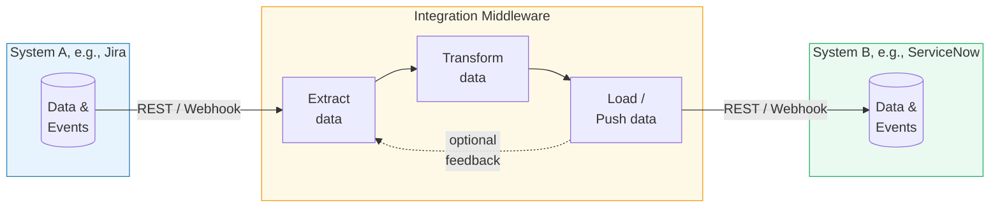
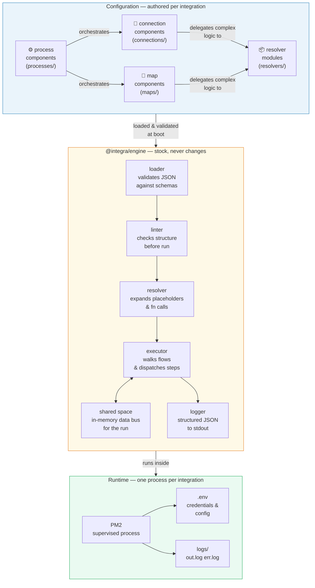

# integra

A configuration-driven integration middleware engine. One instance per integration. No multitenancy. No surprises.

## What is an integration middleware?
 

 
An integration middleware sits between two or more software systems and takes care of the plumbing between them. It speaks to each system in its own language — polling or receiving data from one, transforming it into the shape the other expects, and pushing it across. It handles authentication, retries, error recovery, and logging so that neither system needs to know anything about the other. Without a middleware layer, every integration becomes a one-off script that is hard to observe, harder to maintain, and nearly impossible to reuse.

## Concept

Integra runs integrations as isolated processes. Each integration is a directory containing JSON component files — no code required for common cases, with JS resolver modules available as escape hatches where JSON falls short.

### Three tiers

| Tier | Role |
|---|---|
| `connection` | Talks to a REST API. Reads or writes data. |
| `map` | Reshapes one JSON object into another. |
| `process` | Orchestrates connections and maps via a declarative flow. |


 
Integra's architecture rests on a clean separation between what is **generic** and what is **specific**. The engine is stock — it never changes between integrations. Everything specific to a particular integration lives in JSON component files and JavaScript resolver modules, authored once and loaded at boot. The engine validates, lints, resolves, and executes. It knows nothing about, e.g., ServiceNow or Jira. That knowledge lives entirely in the configuration layer, where it belongs.

### Value syntax

Every value in any component JSON can be:
- **A constant** — `"application/json"`, `true`, `42`
- **A placeholder** — `{{env.MY_VAR}}`, `{{shared.my_key}}`, `{{component.step-id.output.field}}`
- **A function call** — `{{fn:myFunction(arg1, arg2)}}` — resolved by a JS resolver module

---

## Packages

```
packages/
  engine/     — the runtime (@integra/engine)
  cli/        — developer tooling (@integra/cli)
  manager/    — PM2-based supervisor (@integra/manager)
```

---

## Installation

> **Note:** These packages are not yet published to npm.  
> Once published, you'll be able to install globally with:
> ```bash
> npm install -g @integra/engine @integra/cli @integra/manager
> ```

**For now, clone and install locally:**

```bash
# Clone the repository
git clone https://github.com/ciacob/integra.git
cd integra

# Install dependencies and link packages
npm install
npm run bootstrap  # if using lerna/workspaces, or manually link:

# Link packages globally
cd packages/engine && npm link
cd ../cli && npm link
cd ../manager && npm link
```

---

## Developer workflow

```bash
# Scaffold a new integration
integra init my-sn-jira
cd my-sn-jira

# Copy and fill in your credentials
cp .env.example .env

# Author your components in connections/, maps/, processes/, resolvers/
# Set the entry process in integra.json

# Validate structure and schemas without running
integra validate

# Run a process locally
integra run my-process-id
```

---

## Manager workflow

From the directory containing `registry.json`:

```bash
integra-manager start              # spawn all enabled integrations via PM2
integra-manager status             # show uptime, restarts, memory
integra-manager logs my-sn-jira   # tail logs for a specific integration
integra-manager stop my-sn-jira   # stop an integration
integra-manager restart my-sn-jira
integra-manager enable my-sn-jira
integra-manager disable my-sn-jira
```

---

## Example

See `example-sn-jira/` for a full working example that syncs open incidents from ServiceNow to Jira.

```bash
cd example-sn-jira
cp .env.example .env
# Fill in your credentials
integra validate
integra run sync-incident-sn-to-jira
```

---

## Component reference

### Connection

```json
{
  "id": "my-connection",
  "purpose": "read | write | readwrite",
  "request": {
    "type": "GET | POST | PUT | PATCH | DELETE",
    "endpoint": "{{env.BASE_URL}}/path/{{input.id}}",
    "headers": { "Authorization": "{{fn:basicAuth(env.USER, env.PASS)}}" },
    "query": { "limit": "10" },
    "body": "{{shared.payload}}"
  },
  "filter": "{{fn:myFilter(output)}}",
  "output": "{{fn:store('my_key')}}",
  "resolver": "resolvers/my-resolver.js"
}
```

### Map

```json
{
  "id": "my-map",
  "input": "{{shared.source_data}}",
  "output": "{{fn:store('target_data')}}",
  "defaults": { "field": "default_value" },
  "overrides": { "field": "forced_value" },
  "transformation": {
    "base": "{{fn:myTransform(input)}}",
    "defaults": { "source.field": "target.field" },
    "overrides": { "source.other": "target.other" }
  },
  "resolver": "resolvers/my-resolver.js"
}
```

### Process

```json
{
  "id": "my-process",
  "flow": {
    "metadata": { "parallel": false },
    "steps": [
      { "id": "step-1", "component": "my-connection", "onError": "{{fn:handleError(error)}}" },
      { "if": "{{fn:condition(shared.data)}}", "steps": [ { "component": "my-map" } ] },
      { "else": null, "steps": [] },
      {
        "id": "my-loop",
        "while": "{{fn:hasMore(shared)}}",
        "steps": [
          { "component": "my-map" },
          { "if": "{{fn:shouldBreak(shared)}}", "steps": [ { "break": "my-loop" } ] }
        ]
      }
    ]
  }
}
```

---

## License

Apache-2.0 with Commons Clause. Free to use commercially. Not free to resell or rebrand.

---

## Resolver naming convention

All resolver modules are merged into a single flat namespace at runtime. To avoid collisions between modules, **prefix exported function names with a short module identifier**:

```javascript
// resolvers/servicenow.js  — prefix: sn
export function snStore(ctx, key) { ... }
export function snHasResults(ctx) { ... }

// resolvers/jira.js  — prefix: jira
export function jiraStore(ctx, key) { ... }
export function jiraBasicAuth(ctx, user, token) { ... }

// resolvers/sync.js  — flow control, no prefix needed (names are process-specific)
export function hasNextIncident(ctx) { ... }
export function handleFetchError(ctx) { ... }
```

Functions with no arguments can be called without parentheses in JSON:
```json
"filter": "{{fn:snHasResults}}",
"while": "{{fn:hasNextIncident}}"
```

Functions with arguments use parentheses. Bare dot-paths resolve against ctx:
```json
"if": "{{fn:isHighPriority(shared.current_sn_incident.priority)}}"
```
